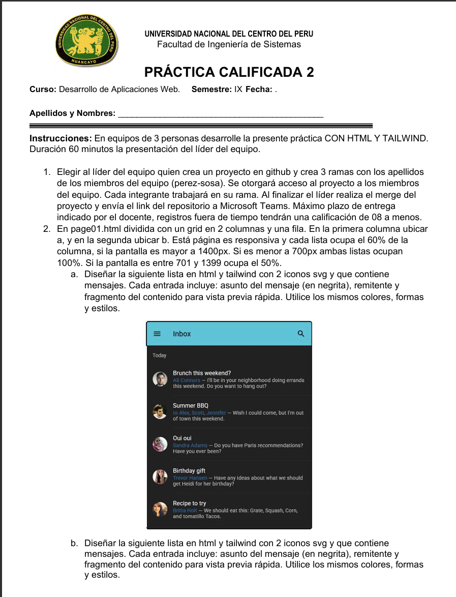

## Resumen

Durante la tercera semana se desarrollaron competencias para el diseño y desarrollo de páginas web Front-End utilizando librerías CSS modernas. Se trabajó con Bootstrap y Tailwind CSS como herramientas principales para la construcción de interfaces visuales estructuradas, responsivas y reutilizables. Asimismo, se abordaron conceptos de layout, tipografía, componentes de interfaz y diseño flexible mediante Flexbox, culminando con una práctica calificada orientada al desarrollo de un sitio web con CSS.

## Clase

- **Desarrollo Front-End con Bootstrap.**  
  Se explicó el uso de la librería CSS Bootstrap para la creación de interfaces web responsivas, destacando su sistema de grid, layouts predefinidos y componentes reutilizables como botones, tarjetas, formularios y barras de navegación.

- **Layouts y componentes en Bootstrap.**  
  Se revisó la estructura de layout basada en contenedores, filas y columnas, así como la integración de componentes visuales que facilitan el desarrollo rápido de interfaces consistentes.

- **Desarrollo Front-End con Tailwind CSS.**  
  Se introdujo Tailwind CSS como un framework basado en clases utilitarias, permitiendo un control más preciso del diseño directamente desde el HTML, sin necesidad de escribir grandes hojas de estilo personalizadas.

- **Tipografía y estilos visuales.**  
  Se trabajaron propiedades de tipografía como fuente, tamaño de texto, espaciado de líneas, colores, fondos, bordes, efectos visuales y estilos para tablas, aplicando buenas prácticas de diseño visual.

- **Gestión de layout y posicionamiento.**  
  Se explicó el uso de clases y propiedades relacionadas con container, columns, breakpoints, display y position para organizar correctamente los elementos dentro de la interfaz.

- **Flexbox en el diseño web.**  
  Se abordaron los conceptos fundamentales de Flexbox, incluyendo dirección, envoltura, crecimiento, reducción y alineación de elementos, como herramienta clave para el diseño flexible y responsivo.

- **Application UI y componentes de interfaz.**  
  Se estudiaron elementos comunes de interfaz como avatares, badges, dropdowns, botones y grupos de botones, así como estructuras más complejas como shells, encabezados, listas, formularios, navegación, overlays y componentes de retroalimentación.

- **Buenas prácticas de diseño Front-End.**  
  Se enfatizó la importancia de la consistencia visual, reutilización de componentes, accesibilidad y adaptación a distintos dispositivos y tamaños de pantalla.

## Laboratorio

- **Práctica Calificada 03:**  
  Desarrollo de un sitio web Front-End utilizando CSS, Bootstrap y/o Tailwind CSS.  
  Implementación de layouts responsivos, componentes visuales y estilos tipográficos, aplicando Flexbox y buenas prácticas de diseño para lograr una interfaz moderna y funcional.
