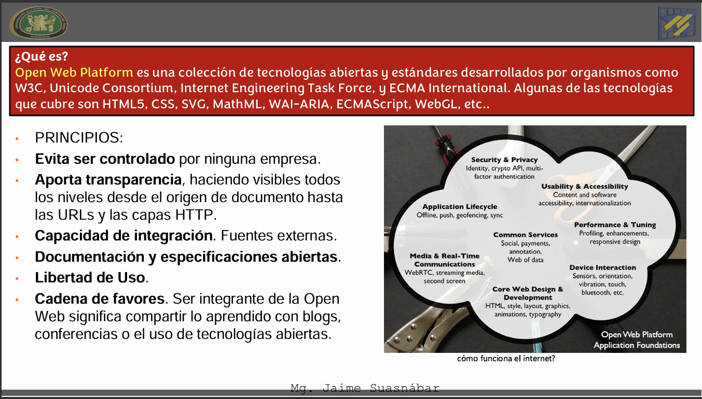

## Resumen

Durante la sexta semana se desarrollaron aplicaciones Front-End utilizando Frameworks JavaScript, enfocándose en el manejo de eventos, estructuras condicionales y bucles. Se abordaron técnicas de renderizado condicional e iterativo, el manejo de formularios y routing, así como el consumo de APIs externas mediante promesas, async/await y la librería Axios. Estos conocimientos permitieron crear aplicaciones dinámicas que interactúan con fuentes de datos externas.

## Clase

- **Eventos en Frameworks JavaScript.**  
  Se explicó el manejo de eventos como clics, envíos de formularios y cambios de estado, permitiendo que la aplicación responda a las acciones del usuario de manera dinámica.

- **Renderizado condicional.**  
  Se trabajó el renderizado de componentes o elementos según condiciones específicas, permitiendo mostrar u ocultar contenido dependiendo del estado de la aplicación.

- **Renderizado iterativo.**  
  Se abordó la renderización de listas de datos utilizando estructuras iterativas, facilitando la visualización dinámica de información proveniente de arreglos u objetos.

- **Manejo de formularios.**  
  Se explicó el uso de formularios en aplicaciones Front-End, incluyendo la captura y validación de datos ingresados por el usuario.

- **Routing en aplicaciones Front-End.**  
  Se introdujo el concepto de routing para la navegación entre diferentes vistas o páginas dentro de una aplicación web sin recargar el navegador.

- **Consumo de APIs.**  
  Se explicó cómo obtener datos desde servicios externos utilizando APIs, permitiendo integrar información dinámica en las aplicaciones web.

- **Promesas y async/await.**  
  Se estudiaron las promesas como mecanismo para manejar operaciones asíncronas y el uso de async/await para simplificar la escritura de código asíncrono.

- **Uso de la librería Axios.**  
  Se introdujo Axios como una librería para realizar solicitudes HTTP, facilitando la comunicación con APIs externas y el manejo de respuestas.

- **Buenas prácticas en aplicaciones dinámicas.**  
  Se resaltó la importancia del manejo correcto del estado, control de errores y organización del código para mejorar la experiencia del usuario.

## Laboratorio

- **Laboratorio 06A:**  
  Desarrollo de una aplicación Front-End que implemente eventos, renderizado condicional e iterativo utilizando datos obtenidos desde una API.  
  Uso de promesas, async/await y Axios para el consumo de servicios externos y presentación dinámica de la información.
