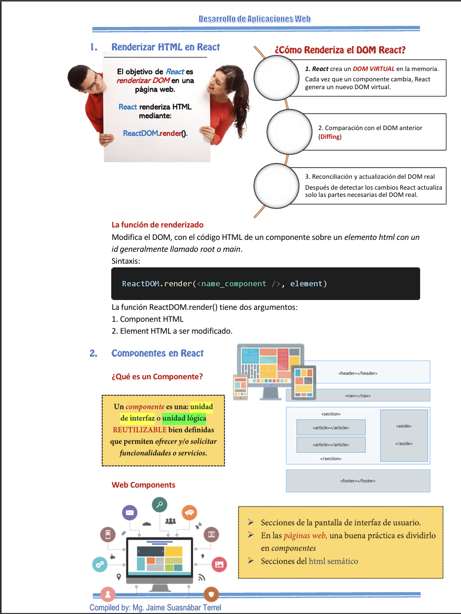

## Resumen

Durante la séptima semana se profundizó en el uso de Hooks dentro de Frameworks JavaScript para la gestión del estado, efectos secundarios y reutilización de lógica en aplicaciones Front-End. Se estudiaron los principales Hooks proporcionados por el framework, la creación de Hooks personalizados y se desarrolló una evaluación de logro para medir el dominio de los conceptos aprendidos.

## Clase

- **Introducción a los Hooks.**  
  Se explicó el concepto de Hooks como una forma de utilizar características del framework sin necesidad de clases, permitiendo manejar estado y lógica de manera más simple y reutilizable.

- **Hook useState.**  
  Se estudió el uso de `useState` para gestionar el estado de los componentes, permitiendo actualizar y renderizar la interfaz en respuesta a cambios de datos.

- **Hook useEffect.**  
  Se explicó el uso de `useEffect` para manejar efectos secundarios como llamadas a APIs, suscripciones y cambios en el ciclo de vida del componente.

- **Hook useContext.**  
  Se abordó el uso de `useContext` para compartir información entre componentes sin necesidad de pasar props manualmente a través de múltiples niveles.

- **Hook useRef.**  
  Se explicó el uso de `useRef` para acceder a elementos del DOM y mantener valores persistentes sin provocar renderizados adicionales.

- **Hook useReducer.**  
  Se estudió `useReducer` como una alternativa a `useState` para la gestión de estados más complejos mediante el uso de reducers y acciones.

- **Hooks de optimización: useCallback y useMemo.**  
  Se explicó el uso de `useCallback` y `useMemo` para optimizar el rendimiento de la aplicación, evitando renderizados innecesarios y mejorando la eficiencia.

- **Hooks personalizados.**  
  Se introdujo la creación de Hooks personalizados para encapsular y reutilizar lógica común entre distintos componentes de la aplicación.

- **Evaluación de logro 01.**  
  Se realizó una evaluación de logro para medir el nivel de comprensión y aplicación de los Hooks en el desarrollo de aplicaciones Front-End.

## Laboratorio

- **Laboratorio 06:**  
  Desarrollo de una aplicación Front-End aplicando el uso de Hooks para la gestión de estado, efectos y reutilización de lógica.  
  Implementación práctica de `useState`, `useEffect` y otros Hooks en un caso de uso real.
