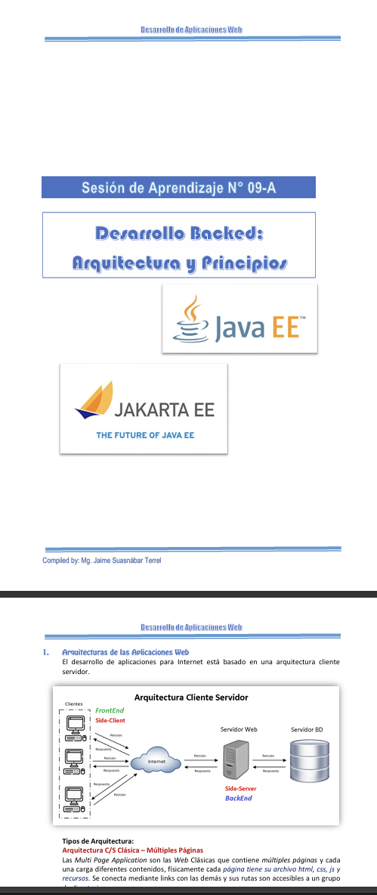

## Resumen

Durante la novena semana se introdujo el desarrollo web del lado del servidor, abordando los fundamentos de la tecnología Web Backend. Se estudiaron los conceptos de arquitectura de aplicaciones web, el funcionamiento de los servidores web y el procesamiento de lógica en el server side. Asimismo, se desarrollaron aplicaciones web utilizando tecnologías backend como PHP y JSP, culminando con el despliegue de aplicaciones web en un entorno de servidor.

 

## Clase

- **Introducción a la tecnología Web Backend.**  
  Se explicó el rol del backend en una aplicación web, destacando su responsabilidad en el procesamiento de la lógica del negocio, la gestión de datos y la comunicación con el frontend.

- **Arquitectura de aplicaciones web.**  
  Se estudiaron los modelos de arquitectura web, analizando la separación entre frontend, backend y base de datos, así como la interacción entre sus componentes.

- **Servidores web y funcionamiento del server side.**  
  Se explicó el funcionamiento de los servidores web, el manejo de peticiones y respuestas HTTP y el procesamiento de solicitudes desde el lado del servidor.

- **Lenguajes y frameworks backend.**  
  Se introdujeron los lenguajes y frameworks utilizados en el desarrollo backend, destacando sus características, ventajas y casos de uso.

- **Desarrollo de aplicaciones web backend.**  
  Se abordó el proceso de desarrollo de aplicaciones web dinámicas, donde el contenido es generado desde el servidor en función de la lógica y los datos.

- **Aplicaciones web con PHP.**  
  Se explicó el uso de PHP como lenguaje backend para la creación de aplicaciones web, abordando la sintaxis básica, el manejo de formularios y la generación dinámica de contenido.

- **Aplicaciones web con JSP.**  
  Se introdujo JSP como tecnología backend basada en Java, explicando su integración con servidores web y su uso para generar páginas dinámicas.

- **Buenas prácticas en desarrollo backend.**  
  Se resaltó la importancia de la organización del código, seguridad básica, validación de datos y correcta comunicación con el frontend.

## Laboratorio

- **Laboratorio 09:**  
  Despliegue de aplicaciones web backend desarrolladas en PHP y JSP.  
  Configuración del servidor web, publicación de las aplicaciones y verificación de su correcto funcionamiento mediante pruebas de acceso desde el navegador.
