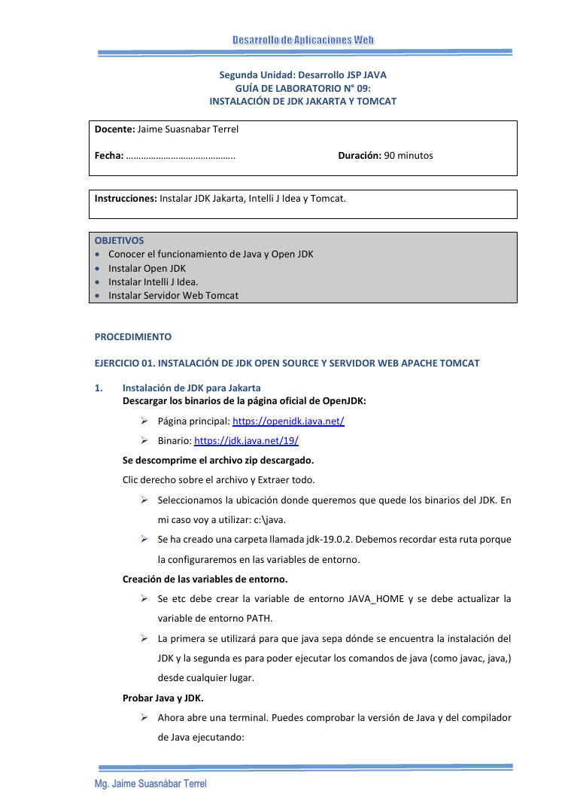

## Resumen

Durante la semana 11 se introdujo el framework Django para el desarrollo de aplicaciones web backend con Python. Se estudió el patrón de arquitectura MVC y su adaptación en Django mediante el enfoque MTV, así como la instalación y gestión de proyectos. Además, se trabajó la configuración de URLs, el desarrollo de vistas y el uso de plantillas. Finalmente, se abordó el modelo de datos mediante la definición de modelos y consultas a base de datos, culminando con un laboratorio orientado a integrar vistas, plantillas y modelos en una aplicación funcional.

## Clase
- **Introducción a Django y su propósito.**  
  Se presentó Django como un framework robusto y productivo para el desarrollo web, destacando su filosofía de “baterías incluidas”, su enfoque en seguridad, escalabilidad y su integración natural con Python.

- **Patrón de arquitectura MVC y MTV.**  
  Se explicó el patrón MVC como referencia general y su equivalencia en Django mediante MTV (Model–Template–View), analizando cómo se organiza la lógica de negocio, la presentación y el control de flujo dentro del framework.

- **Instalación y configuración del entorno.**  
  Se revisó la instalación de Django, el uso de entornos virtuales y la gestión de dependencias para mantener proyectos organizados y reproducibles.

- **Gestión de proyectos y aplicaciones.**  
  Se explicó la creación de proyectos desde la línea de comandos, la estructura de carpetas generada por Django y la creación de aplicaciones internas para modularizar funcionalidades.

- **Integración y despliegue con Apache (visión general).**  
  Se introdujo el concepto de integración de Django en entornos de servidor mediante Apache, comprendiendo su utilidad en escenarios de despliegue y producción.

- **Gestión de URLs y enrutamiento.**  
  Se explicó la configuración de URLs, el mapeo de rutas a vistas y el rol del enrutamiento como mecanismo para definir la navegación lógica de la aplicación web.

- **Creación de vistas (function-based y class-based).**  
  Se desarrollaron vistas basadas en funciones y vistas basadas en clases, analizando sus diferencias, ventajas y casos de uso en proyectos reales.

- **Uso de plantillas (templates).**  
  Se trabajó el sistema de plantillas de Django, incluyendo el uso de bloques, herencia de plantillas, etiquetas y filtros, permitiendo construir interfaces reutilizables y consistentes.

- **Modelo de datos y ORM de Django.**  
  Se introdujo la creación de modelos para base de datos, tipos de campos y el uso de la API ORM de Django para ejecutar consultas de manera segura y eficiente sin escribir SQL de forma directa.

- **Creación de consultas y manejo de datos.**  
  Se revisaron operaciones comunes como inserción, actualización, filtrado y recuperación de datos mediante consultas ORM, reforzando el enfoque de persistencia de datos en aplicaciones backend.

## Laboratorio
- **Laboratorio 11:**  
  Desarrollo de una aplicación Django integrando **URLs, vistas, plantillas y modelos**.  
  Implementación de rutas funcionales, vistas (función o clase), plantillas con herencia y un modelo conectado a base de datos para realizar operaciones básicas de consulta y presentación de información.
