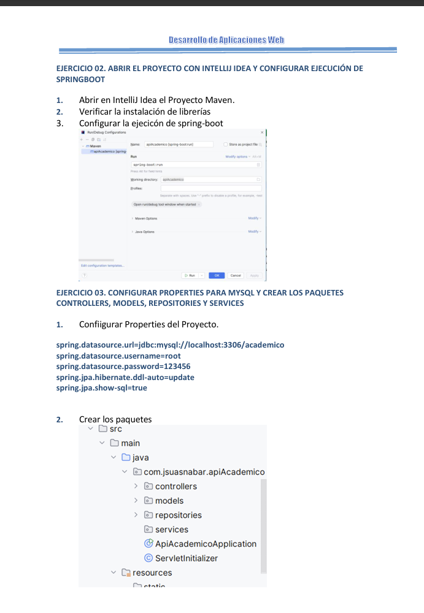

## Resumen

Durante la semana 12 se desarrollaron funcionalidades clave para aplicaciones web backend con Django, enfocándose en la gestión de formularios, validación y sanitización de datos. Asimismo, se trabajó con Django Admin para la administración y personalización de modelos, incluyendo formularios personalizados y campos calculados. Finalmente, se abordaron conceptos de middleware, manejo de sesiones, autenticación y autorización, culminando con el desarrollo de un sistema web backend como parte del laboratorio.

## Clase
- **Gestión de formularios en Django.**  
  Se explicó el uso de formularios en Django como mecanismo para capturar datos del usuario de manera estructurada, facilitando el procesamiento seguro de información dentro de la aplicación.

- **Creación de formularios y plantilla del formulario.**  
  Se trabajó la creación de formularios mediante clases de Django Forms, así como su integración en plantillas HTML para una correcta presentación y captura de datos.

- **Validación y sanitización de datos.**  
  Se abordó la validación de campos y la sanitización de entradas para prevenir errores y vulnerabilidades, utilizando validadores integrados y validaciones personalizadas según reglas del negocio.

- **Introducción a Django Admin.**  
  Se introdujo Django Admin como herramienta de administración rápida de modelos y datos, destacando su utilidad para gestionar información sin construir interfaces adicionales desde cero.

- **Personalización y registro de modelos en Admin.**  
  Se explicó el registro de modelos, la personalización básica de vistas de administración y la mejora de la experiencia de gestión mediante listados, filtros, búsquedas y configuraciones visuales.

- **Campos calculados y formularios personalizados en Admin.**  
  Se trabajó la creación de campos calculados para mostrar información derivada y la personalización de formularios dentro del panel de administración según necesidades del sistema.

- **Middleware en Django.**  
  Se explicó el concepto de middleware como capa intermedia en el procesamiento de solicitudes y respuestas, permitiendo aplicar lógica transversal como seguridad, registro de actividad o control de acceso.

- **Manejo de sesiones.**  
  Se abordó el manejo de sesiones para mantener estado entre peticiones, identificando al usuario y almacenando información temporal relevante durante su navegación.

- **Autenticación y autorización.**  
  Se explicó el sistema de autenticación de Django para gestionar usuarios, inicio de sesión y permisos, así como la autorización para controlar el acceso a recursos según roles y privilegios.

## Laboratorio
- **Laboratorio 12:**  
  Desarrollo de un sistema web backend con Django integrando formularios, validación de datos, administración con Django Admin y gestión de sesiones.  
  Implementación de autenticación y autorización para proteger funcionalidades del sistema y asegurar el acceso controlado a los recursos.
