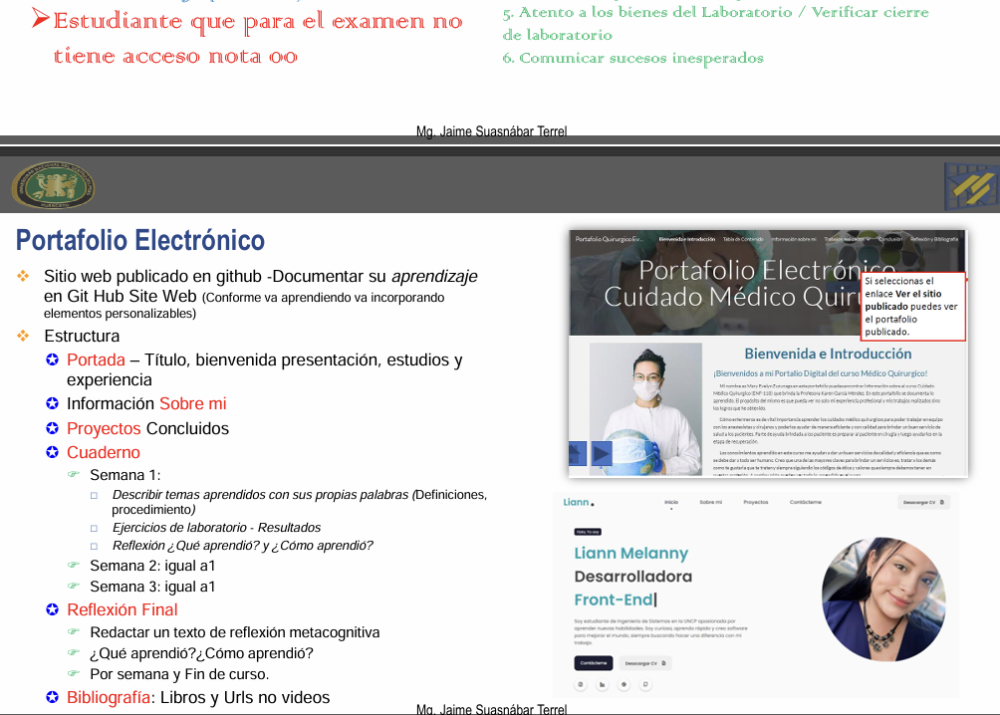

📌 **SEMANA DE EVALUACIÓN FINAL Y CONSOLIDACIÓN**

Esta semana estuvo orientada a la **evaluación final del curso** y a la **revisión integral del portafolio educativo**, consolidando los aprendizajes desarrollados a lo largo de las 16 semanas.

## Descripción

Durante la semana 16 se realizó la **revisión de la evaluación final**, brindando retroalimentación individual y grupal sobre el desempeño académico alcanzado. Asimismo, se efectuó el **consolidado final de la evaluación continua**, permitiendo identificar logros, competencias desarrolladas y el nivel de dominio alcanzado en el desarrollo de aplicaciones web Front-End y Backend.

## Actividades realizadas
- Revisión de la Evaluación de Logro 02.
- Revisión integral del portafolio educativo (semanas 1 a la 16).
- Retroalimentación final sobre prácticas, laboratorios y proyectos desarrollados.
- Evaluación del cumplimiento de evidencias y contenidos del portafolio.
- Orientación final para el cierre académico del curso.

## Evaluación
- **Evaluación Final (Evaluación de Logro 02).**
- **Consolidado final de la evaluación continua.**
- **Revisión y validación del portafolio educativo completo (semanas 1–16).**

## Cierre

La semana final permitió consolidar los aprendizajes obtenidos durante el curso, evaluar el progreso académico de manera integral y cerrar el proceso formativo, evidenciando el desarrollo de competencias en tecnologías web, buenas prácticas de programación y responsabilidad académica.
